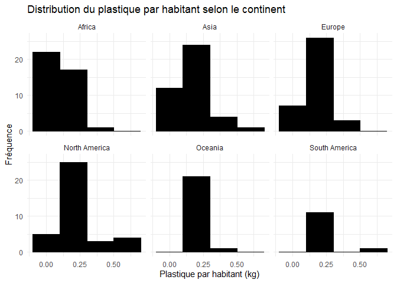
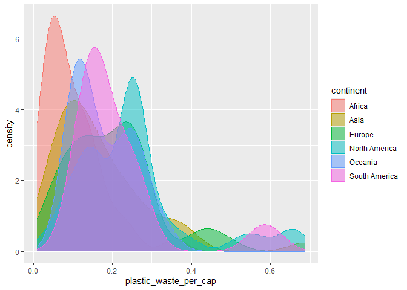

Lab 02 - Plastic waste
================
Mario Sanchez
2025-09-15

## Chargement des packages et des données

``` r
library(tidyverse)
library(ggplot2)
```

``` r
plastic_waste <- read_csv("data/plastic-waste.csv")
```

Commençons par filtrer les données pour retirer le point représenté par
Trinité et Tobago (TTO) qui est un outlier.

``` r
plastic_waste <- plastic_waste %>%
  filter(plastic_waste_per_cap < 3.5)
```

## Exercices

### Exercise 1

``` r
ggplot(plastic_waste, aes(x = plastic_waste_per_cap)) +
  geom_histogram(binwidth = 0.2, fill = "black", color = "black") +
  facet_wrap(~ continent) +
  labs(
    title = "Distribution du plastique par habitant selon le continent",
    x = "Plastique par habitant (kg)",
    y = "Fréquence"
  ) +
  theme_minimal()
```

<!-- -->

### Exercise 2

``` r
ggplot(plastic_waste, aes(x = plastic_waste_per_cap, colour= continent, fill=continent)) +
  geom_density(alpha=0.5)
```

<!-- -->

Color/fill c’est pour des données spécifiques ex: un continent, tandis
qu’alpha c’est pour changer tout le graphique en meme temps

### Exercise 3

Boxplot:

``` r
# insert code here
```

Violin plot:

``` r
# insert code here
```

Réponse à la question…

### Exercise 4

``` r
# insert code here
```

Réponse à la question…

### Exercise 5

``` r
# insert code here
```

``` r
# insert code here
```

Réponse à la question…

## Conclusion

Recréez la visualisation:

``` r
# insert code here
```
