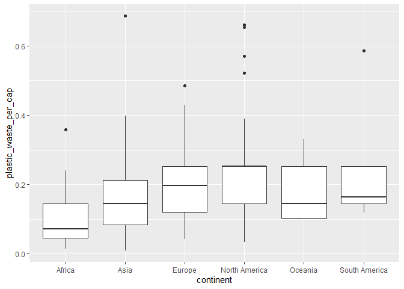
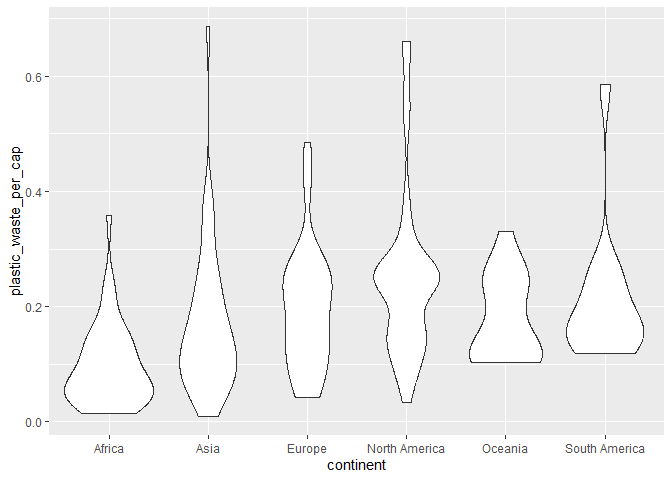
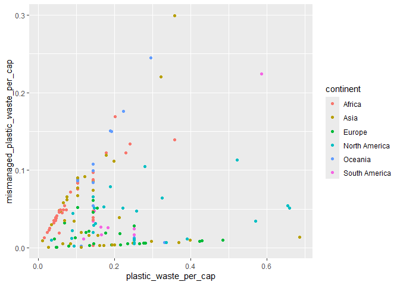
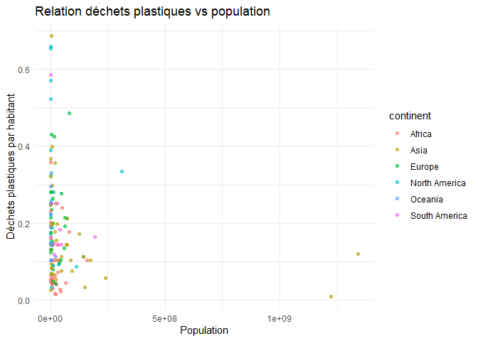
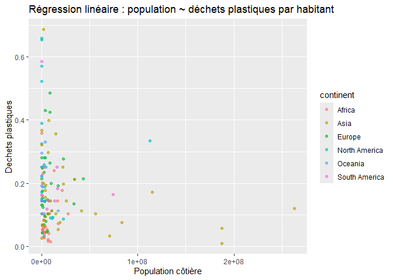
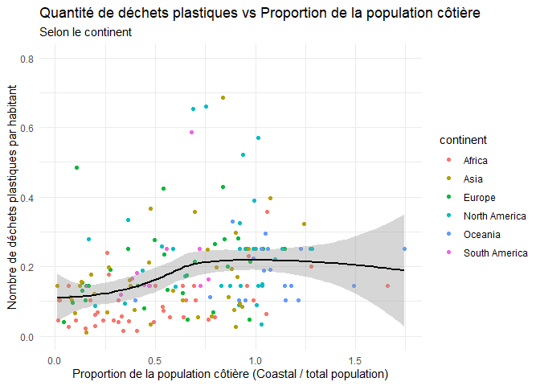

Lab 02 - Plastic waste
================
Mario Sanchez
2025-09-15

## Chargement des packages et des données

``` r
library(tidyverse)
library(ggplot2)
```

``` r
plastic_waste <- read_csv("data/plastic-waste.csv")
```

Commençons par filtrer les données pour retirer le point représenté par
Trinité et Tobago (TTO) qui est un outlier.

``` r
plastic_waste <- plastic_waste %>%
  filter(plastic_waste_per_cap < 3.5)
```

## Exercices

### Exercise 1

``` r
ggplot(plastic_waste, aes(x = plastic_waste_per_cap)) +
  geom_histogram(binwidth = 0.2, fill = "black", color = "black") +
  facet_wrap(~ continent) +
  labs(
    title = "Distribution du plastique par habitant selon le continent",
    x = "Plastique par habitant (kg)",
    y = "Fréquence"
  ) +
  theme_minimal()
```

<!-- -->

### Exercise 2

``` r
ggplot(plastic_waste, aes(x = plastic_waste_per_cap, colour= continent, fill=continent)) +
  geom_density(alpha=0.5)
```

<!-- -->

Color/fill c’est pour des données spécifiques ex: un continent, tandis
qu’alpha c’est pour changer tout le graphique en meme temps

### Exercise 3

Boxplot:

``` r
ggplot(plastic_waste, aes(x=continent, y = plastic_waste_per_cap)) +
  geom_boxplot()
```

<!-- -->

Violin plot:

``` r
ggplot(plastic_waste, aes(x = continent, y = plastic_waste_per_cap)) +
  geom_violin()
```

<!-- -->

Violin plots montre la densité des points tandis que le boxplot non

### Exercise 4

``` r
ggplot(plastic_waste, aes(x =plastic_waste_per_cap, y = mismanaged_plastic_waste_per_cap, colour=continent)) + 
  geom_point() 
```

<!-- --> On
voir que les pays qui ont le moins de déchets ont tendance a moins bien
gerer leurs dechets(asie et afrique). Tandis que les autres continents
ont plus de déchets mais les gerent mieux

### Exercise 5

``` r
ggplot(plastic_waste, aes(x = total_pop, y = plastic_waste_per_cap, colour=continent)) +
  geom_point(alpha = 0.6)+
  labs(
    title = "Relation déchets plastiques vs population",
    x = "Population",
    y = "Déchets plastiques par habitant"
  ) +
  theme_minimal()
```

    ## Warning: Removed 10 rows containing missing values or values outside the scale range
    ## (`geom_point()`).

<!-- -->

``` r
library(ggplot2)

ggplot(plastic_waste, aes(x = coastal_pop, y = plastic_waste_per_cap, colour=continent)) +
  geom_point(alpha = 0.6) +
  labs(
    title = "Régression linéaire : population ~ déchets plastiques par habitant",
    x = "Population côtière",
    y = "Dechets plastiques")
```

<!-- -->

Non, les deux ont pas de relation forte, juste la chine qui influence la
perception de la relation

## Conclusion

Recréez la visualisation:

``` r
library(ggplot2)

# Calcul de la proportion de population côtière
df <- read.csv("data/plastic-waste.csv")

# Calcul de la proportion de population côtière
df$proportion_cotiere <- df$coastal_pop / df$total_pop

# Graphique
ggplot(df, aes(x = proportion_cotiere,
               y = plastic_waste_per_cap,
               color = continent)) +
  geom_point() +
  ylim(0,0.8)+
  geom_smooth(method = "loess", se = TRUE, color = "black") +
  labs(
    title = "Quantité de déchets plastiques vs Proportion de la population côtière",
    subtitle = "Selon le continent",
    x = "Proportion de la population côtière (Coastal / total population)",
    y = "Nombre de déchets plastiques par habitant"
  ) +
  theme_minimal()
```

    ## `geom_smooth()` using formula = 'y ~ x'

    ## Warning: Removed 62 rows containing non-finite outside the scale range
    ## (`stat_smooth()`).

    ## Warning: Removed 62 rows containing missing values or values outside the scale range
    ## (`geom_point()`).

<!-- -->

``` r
# insert code here
```
